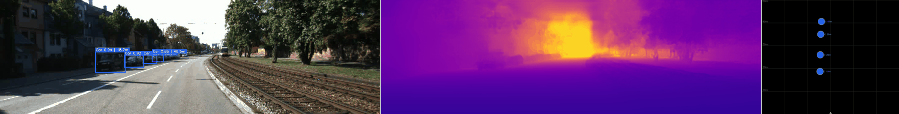
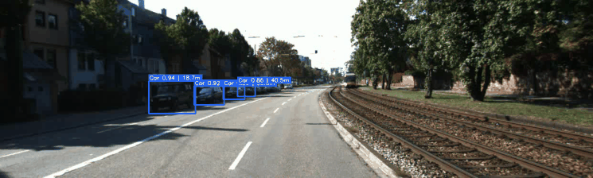
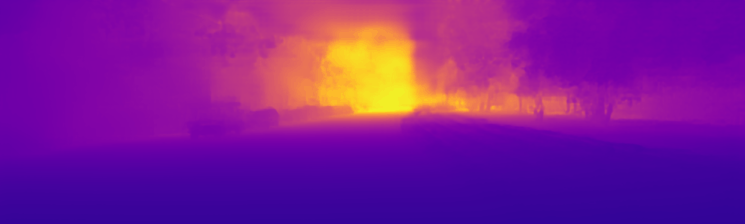
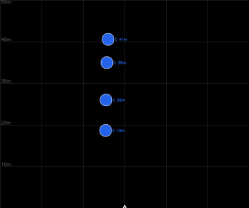

# Object, Depth, and Trajectory Estimation for Autonomous Vehicles

**ECE 228 — Scene Reconstruction for Autonomous Driving**
**Team 56:** Aidan Manternach, Manasvin Surya BJ, Francisco Garcia, Harini Sabapathy

A camera-only 3D scene-reconstruction pipeline for autonomous driving. Using a single monocular camera stream, the system detects road agents, estimates their metric depth, projects them into a bird's-eye-view (BEV), tracks them across time, and predicts their trajectories — inspired by the Tesla Full Self-Driving visualization and extended to explicit trajectory prediction.

---

## What this project does

Autonomous vehicles must understand and predict the dynamics of their environment in real time, under tight compute and memory budgets. Our goal is an **end-to-end, camera-only pipeline** that reconstructs the 3D scene and forecasts agent motion without LiDAR at inference time.

The pipeline runs in four stages:

| Stage | Method | Output |
|---|---|---|
| **1. Object Detection** | YOLOv8m fine-tuned on KITTI | 2D bounding boxes for Car, Pedestrian, Cyclist |
| **2. Depth Estimation** | Depth Anything V2 (Metric, Outdoor) | Per-pixel metric depth (metres) |
| **3. BEV Fusion** | Camera intrinsics unprojection | Top-down bird's-eye-view of all agents |
| **4. Trajectory Prediction** | Kalman filter + ego-motion compensation | World-frame tracks, velocities, crossing intent |

We use the **KITTI dataset** — real-world driving sequences from a moving vehicle, with ground-truth object labels and LiDAR depth — as the benchmark for training and evaluation.

```
 Camera frame
      │
      ▼
┌─────────────┐     ┌──────────────────┐
│  YOLOv8m    │     │ Depth Anything V2 │
│ detection   │     │  metric depth     │
└──────┬──────┘     └─────────┬─────────┘
       │   bbox                │  depth(u,v)
       └──────────┬────────────┘
                  ▼
          BEV fusion (unproject → top-down)
                  │
                  ▼
   Kalman tracking + ego-motion compensation
                  │
                  ▼
       Trajectory + crossing-intent prediction
```

---

## Demonstrations

Generated by the inference pipeline in [`bev_inference/`](bev_inference/) on a sequential KITTI drive. Every run also prints quantitative validation statistics to the terminal.

**Composite — detection · depth · bird's-eye-view (left → right):**



**2D detection with per-object depth labels:**



**Depth Anything V2 metric depth:**



**Bird's-eye-view (top-down reconstruction):**



---

## Repository structure

| Folder | Contents |
|---|---|
| [`yolov8-finetuning/`](yolov8-finetuning/) | Fine-tuning YOLOv8m on KITTI (3 classes) + the trained `best.pt` checkpoint |
| [`depth-model/`](depth-model/) | Loading and evaluating Depth Anything V2 against KITTI LiDAR |
| [`bev_fusion/`](bev_fusion/) | Notebook that fuses detection + depth into a bird's-eye-view |
| [`bev_trajectory_modelling/`](bev_trajectory_modelling/) | Kalman tracking, ego-motion compensation, and crossing-intent prediction |
| [`bev_inference/`](bev_inference/) | **Standalone, reproducible inference scripts** (images / KITTI / video → GIFs + stats) |
| [`assets/`](assets/) | Demonstration GIFs used in this README |

The research and development happens in the notebooks (`yolov8-finetuning`, `depth-model`, `bev_fusion`, `bev_trajectory_modelling`). The `bev_inference/` folder packages the resulting pipeline into command-line scripts that reproduce the results on any machine.

---

## Quick start — running the pipeline

All runnable, reproducible code lives in [`bev_inference/`](bev_inference/). It auto-detects the best device (`cuda` > `mps` > `cpu`) and works on Colab, macOS (Apple Silicon), Linux/Windows GPUs, and CPU-only machines.

### 1. Install dependencies

```bash
cd bev_inference
pip install -r requirements.txt
```

On Google Colab, append `--install-deps` to any script instead of running the install step separately.

### 2. Run on a sequential KITTI drive

```bash
# Download 50 consecutive frames from a single KITTI raw drive (~800 MB)
python download_kitti.py

# Process all frames → per-frame PNGs, GIFs, and validation stats
python run_kitti.py
```

### 3. Run on your own images

```bash
# Drop .png/.jpg files into bev_inference/inputs/, then:
python run_inputs.py
```

### 4. Run on a video

```bash
# Drop a landscape video into bev_inference/vid_input/, then:
python run_video.py
```

The video script automatically extracts temporally ordered frames (sampling at a target FPS and down-scaling to an optimal processing width), then runs the identical detection → depth → BEV pipeline.

### Outputs

Every run rewrites `bev_inference/outputs/` with:

- **Per-frame PNGs** — RGB+detections, depth map, BEV canvas, and a 3-panel composite
- **Animated GIFs** — `detection.gif`, `depth.gif`, `bev.gif`, `composite.gif`
- **`summary.json`** — per-frame detection counts, timings, and 3D coordinates
- **Terminal validation report** — detections/frame, FPS, per-class depth & confidence, depth distribution

See [`bev_inference/README.md`](bev_inference/README.md) for the complete CLI reference and all options.

---

## Models

- **YOLOv8m** fine-tuned on KITTI (Car / Pedestrian / Cyclist). The trained checkpoint is committed at [`yolov8-finetuning/best.pt`](yolov8-finetuning/best.pt) and is the default weights used by every inference script.
- **Depth Anything V2** — `depth-anything/Depth-Anything-V2-Metric-Outdoor-Small-hf`, downloaded automatically from HuggingFace on first run.

---

## Reproducing the research

The Jupyter notebooks are written for Google Colab with a GPU (T4 or better) and each contains its execution order at the top:

1. **`yolov8-finetuning/yolov8_kitti_finetune.ipynb`** — fine-tune YOLOv8m, evaluate mAP, export `best.pt`
2. **`depth-model/depth_model.ipynb`** — evaluate Depth Anything V2 against KITTI LiDAR
3. **`bev_fusion/bev_fusion_1.ipynb`** — fuse detection + depth into BEV
4. **`bev_trajectory_modelling/bev_trajectory_prediction_with_validation.ipynb`** — full tracking + trajectory prediction with validation

For day-to-day reproduction of results, prefer the scripted pipeline in `bev_inference/`.
